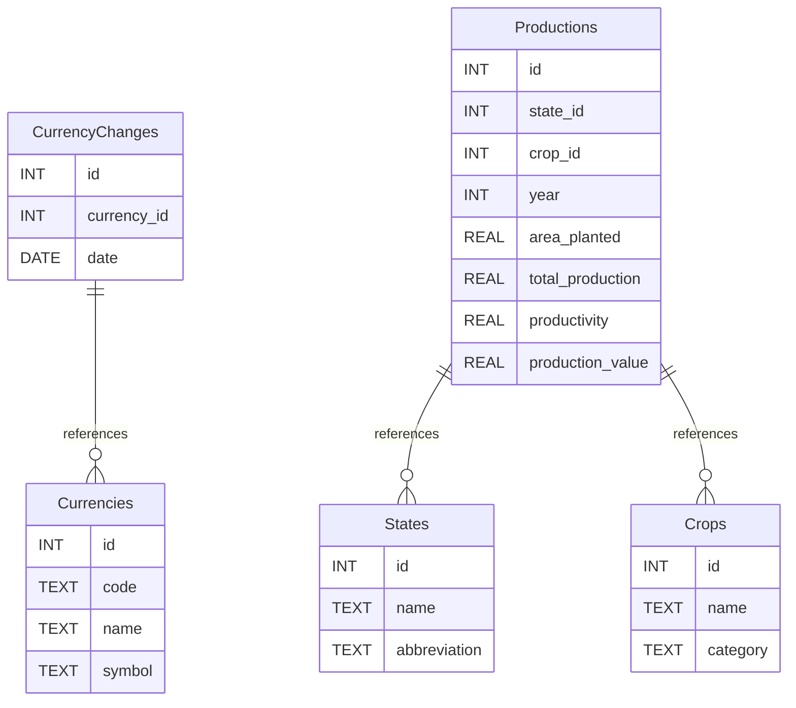

# Ch. 10 - Explorando SQL e tipos de dados na Oracle

> [!NOTE]
> Este projeto faz parte de um curso de Inteligência Artificial na [FIAP](https://github.com/fiap). Este repositório refere-se à atividade 2 da fase 3.

## Objetivo do Projeto

O objetivo deste projeto é aplicar os conceitos de modelagem de dados adquiridos nos capítulos 7, 8, 9 e 10, visando a criação de um modelo de banco de dados eficiente e normalizado para armazenar e analisar informações sobre a produção agrícola no Brasil. Utilizando dados provenientes do órgão oficial IBGE/SIDRA, desenvolvemos uma estrutura que permita a consulta e análise de dados relevantes sobre a produção agrícola, incluindo área plantada, produtividade e produção de diversas culturas em diferentes estados e safras.

## Sobre o Modelo de Dados Criado

Para saber sobre a descrição do modelo criado acesse:

- [Modelo Conceitual](/docs/conceptual_model.md)
- [Estrutura do Modelo Lógico](/docs/logical_model_structure.md)

## Sobre o Processo de Desenvolvimento

1. **Criação do TODO**: O planejamento é gerado utilizando o ChatGPT a partir do enunciado da atividade. As tarefas geradas podem ser visualizadas [aqui](/TODO.md).
2. **Coleta de Dados**: A coleta de dados é realizada com base nas fontes do IBGE/SIDRA. Saiba mais sobre a fonte de dados [aqui](/docs/dataset.md).
3. **Análise de Dados**: Os dados são analisados para identificar entidades e relacionamentos, utilizando o LibreOffice Calc para visualização. Os dados estão armazenados na pasta `/data`.
4. **Elaboração de Arquivo SQL**: Um arquivo SQL é criado como a fonte central de verdade, com o auxílio do ChatGPT e do GitHub Copilot.
   - **Normalização**: Aplicam-se regras de normalização (1NF, 2NF e 3NF) para refinar o modelo, reduzindo redundâncias e eliminando anomalias.
   - **Convenção de Nomenclatura Padronizada**: Estabelecem-se convenções de nomenclatura padronizadas para tabelas e campos.
5. **Geração do Modelo Conceitual**: O modelo conceitual é gerado a partir do SQL fonte com a ajuda do ChatGPT. É possível acessar o modelo conceitual [aqui](/docs/conceptual_model.md).
6. **Exportação do Diagrama do Modelo Lógico**: O diagrama do modelo lógico é exportado em formato PNG a partir do SQL fonte, utilizando [DrawDB](https://drawdb.vercel.app/editor). O diagrama pode ser visualizado [aqui](/assets/diagram.png). Para mais informações da estrutura do modelo lógico confira [aqui](/docs/logical_model_structure.md).
   
7. **Geração do Modelo Físico**: O modelo físico (Oracle) é criado a partir do SQL fonte com o apoio do ChatGPT. O script de criação de tabelas está disponível [aqui](/scripts/migration.oracle.sql).
   - O dicionário de dados pode ser acessado [aqui](/docs/dd.md).
8. **Desenvolvimento de Consultas em SQL**: Consultas SQL são desenvolvidas para análise de dados. Os scripts podem ser consultados [aqui](/scripts/session.sql).
9.  **Testes**: Testes generativos são realizados com o auxílio do ChatGPT, Gemini e Claude, além de avaliações feitas pela equipe.
10. **Documentação**: A documentação é produzida com o suporte das ferramentas ChatGPT, GitHub Copilot e DrawIO.
11. **Revisão Final pela Equipe**: Uma revisão minuciosa de todo o conteúdo gerado pelas IAs é realizada, visando garantir a qualidade, precisão e coerência do trabalho.

## Pré-visualização do Modelo Lógico



---

```
        ,,,                      ,,,
       {{{}}    ,,,             {{{}}    ,,,
    ,,, ~Y~    {{{}},,,      ,,, ~Y~    {{{}},,, 
   {{}}} |/,,,  ~Y~{{}}}    {{}}} |/,,,  ~Y~{{}}}
    ~Y~ \|{{}}}/\|/ ~Y~  ,,, ~Y~ \|{{}}}/\|/ ~Y~  ,,,
    \|/ \|/~Y~  \|,,,|/ {{}}}\|/ \|/~Y~  \|,,,|/ {{}}}
    \|/ \|/\|/  \{{{}}/  ~Y~ \|/ \|/\|/  \{{{}}/  ~Y~
    \|/\\|/\|/ \\|~Y~//  \|/ \|/\\|/\|/ \\|~Y~//  \|/
    \|//\|/\|/,\\|/|/|// \|/ \|//\|/\|/,\\|/|/|// \|/
   ^^^^^^^^^^^^^^^^^^^^^^^^^^^^^^^^^^^^^^^^^^^^^^^^^^^
```